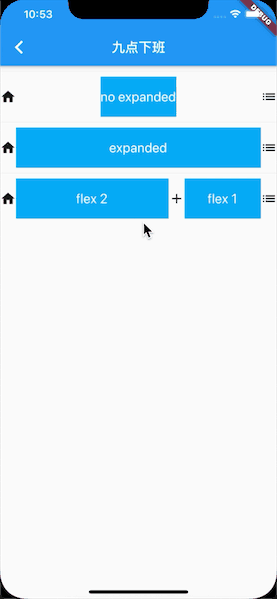
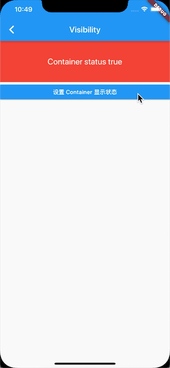
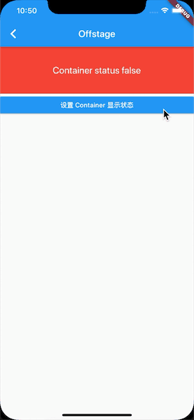
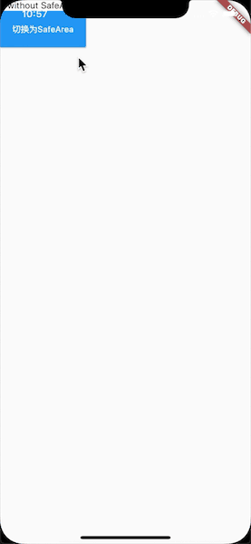
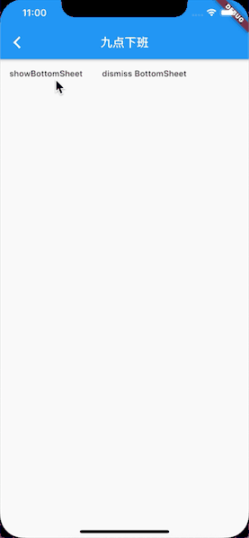
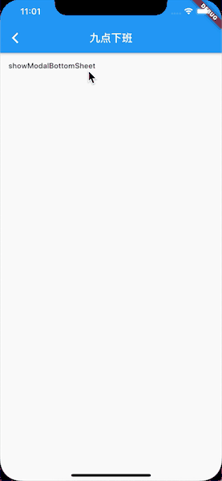
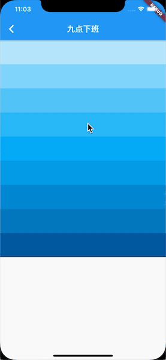
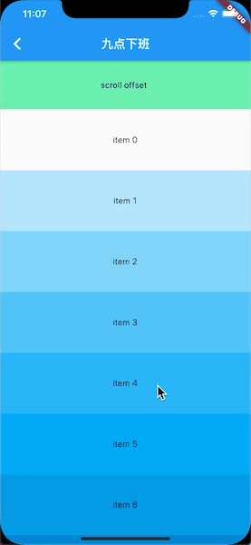

# awesome flutter

[Flutter Widget 分类](https://flutter.dev/docs/development/ui/widgets)

Flutter 项目开发中常用的 Widget 一些基础功能，由于每个 Widget 都有很多的属性，这里只列出了基本也是最常用的属性，更多的用法可以看 Widget 中每个属性的注释。我会持续更新这个 demo 集合，同时后续会增加更多自定义的 Widget。

## DemoButton

常用的几种 Button

RaisedButton:Material Design 风格的 Button

FlatButton:扁平化的 Button

OutlineButton:带边框的 Button

IconButton:带 icon 的 Button

## DemoColumn

列布局，继承自 Flex 可以对主轴和交叉轴进行设置来调整 Column 内的布局方式。

## DemoRow

行布局，和列布局类似，继承自 Flex 可以对主轴和交叉轴进行设置来调整 Row 内的布局方式。

## DemoExpanded

Expanded 必须方法 Flex 中，它会把 Flex 剩余的控件撑满，同时还可以给 Expanded 设置撑开的比例。

## DemoStack

栈布局，就像栈一样一层一层网上叠加，类似于 Android 里的 FrameLayout。可以通过 Positioned Widget 设置子 Widget 的位置。

## DemoVisibility

控制 Widget 的隐藏和显示。

## DemoOffstage

和 Visibility 类似控制 Widget 的隐藏和显示，比 Visibility 拥有更多的属性，可以在 Widget 隐藏之后不占用屏幕空间。

## DemoSafeArea

安全区域，加上之后会自动适配 Android 或者 iOS 的刘海屏。

## DemoBottomSheet

底部弹出 Widget。

## DemoBottomModalSheet

模态的底部弹出 Widget。

## DemoRefreshIndicator

Android 风格的下拉刷新

## DemoBottomNavigationBar

底部导航

## DemoDrawer

抽屉效果。

## DemoSliverAppBarBasic

SliverAppBar的基本使用

## DemoSliverAppBarAdvance

SliverAppBar 和 TabBarView 一起使用

## DemoCustomScrollView

自定义 CustomScrollView 支持嵌套各种布局，如 List、Grid 等

## DemoScrollController

滚动控制器，可以监听滚动过程中的位移。

## DemoScrollNotification

滚动监听，可以监听滚动过程中的位移。

## DemoRefreshLoadMore

简单自定义的下拉刷新和加载更多

## DemoStateProvider

使用 Provider 实现的状态管理

